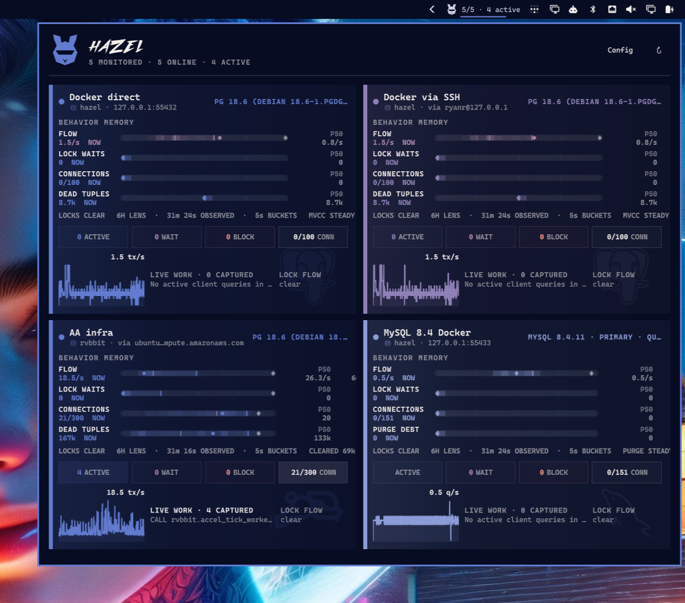

# Hazel

Hazel is a read-only database instrument for the Omarchy 4 bar. It monitors
PostgreSQL, MySQL 8+, MariaDB, Percona Server, and ClickHouse through native,
noninteractive clients. PostgreSQL and the MySQL family keep one persistent
session per enabled profile; ClickHouse uses one bounded client process per
sample because its native batch client consumes queries through EOF. Every collector keeps its own time-bucketed
session history in memory and never writes to the database it observes.



Hazel is deliberately not a tiny Grafana dashboard. Its first job is to show
what changed: work rate, session pressure, waits and blocking, log generation,
and engine-native maintenance signals.

The bar uses Hazel's original angular Visor rabbit mark rather than a text
abbreviation. The open-panel HAZEL wordmark uses five embedded vector outlines
derived from the Outrun Future Bold display face; Hazel does not ship or load
the reusable font software. A larger Visor spans the panel header's two text rows,
replaces the generic status dot, and inherits its live fleet-status color
without increasing the header height. No font or artwork is fetched while
Hazel is running. Both Visors use the SVG's original path geometry through Qt
Quick Shape, keeping the enlarged header mark vector-sharp instead of scaling
a rasterized texture. The wordmark uses that same native curve renderer and
remains theme-tintable at every display scale.

Collapsed profile cards carry a faint, theme-tinted engine mark in a fixed
watermark bay. PostgreSQL uses the embedded CC0 SVG Repo elephant; databases
with the `pg_rvbbit` extension installed use Hazel's embedded rvbbit mark
instead. MySQL uses the embedded dolphin, MariaDB its sea-lion, and Percona its
triangular loop mark. Each is theme-tinted in the same fixed bay, which remains
the contract for future adapters. ClickHouse uses its column mark.

Profile cards are separated by space and their persistent accent rail rather
than a perimeter stroke. A small embedded database glyph carries that same
profile accent beside the database and route in compact and expanded views.

When the panel is open, Hazel also samples active client queries and current
blocking edges. Query whitespace is normalized and string/number literals are
masked by each adapter before the text reaches the UI; idle sessions are not
shown. Lock flow is rendered holder-to-waiter with the waiting mode and target
when the engine exposes them. MySQL and Percona combine InnoDB data-lock waits
and pending metadata locks. MariaDB reads its native `INNODB_LOCKS` and
`INNODB_LOCK_WAITS` views, plus metadata locks when their Performance Schema
instrument is enabled. Every lock-capable adapter labels each edge by lock family.
ClickHouse has no synthetic lock lane: its expanded surface instead shows live
merges and mutations, with a restrained moving-part conveyor only while the
server is doing real background work.

Summary collection for every enabled profile continues while the panel is
closed (every five seconds by default), so reopening Hazel preserves the
context gathered while it was out of sight. The Pressure Memory view uses
those per-profile five-second buckets to show the
current value, p50, p90, and session high-water mark for engine-native work
flow, lock-wait counts, used connections, and maintenance backlog. Connections are
shown as an actual used/max count while their rail zooms to the observed range.
PostgreSQL pairs dead-tuple history with a five-minute accumulation or drain
rate and active/recent autovacuum state. The MySQL family instead shows purge
debt from the InnoDB undo history list, its accumulation/drain trend, and
available purge threads. The lock row pairs its baseline with the current blocked count and
oldest wait age.
ClickHouse replaces those relational lanes with finished query flow, running
queries, server memory against its effective limit, and merge/mutation debt.
Its part surface keeps active part counts and per-table rows/bytes in view.
The window is configurable from
1–24 hours and defaults to six hours. History remains memory-only in v0.4 and
resets when the Omarchy shell restarts. Flow subtracts Hazel's own known
snapshot work so an otherwise quiet database still reads as quiet.

## Status

This is an early working shell. PostgreSQL, MySQL 8, MariaDB, Percona, and ClickHouse
summary/detail snapshots are implemented. Future releases will deepen capability-aware views and may
add optional SQLite or DuckDB history outside the monitored database.

The PostgreSQL watermark is adapted from the CC0 mark at
https://www.svgrepo.com/svg/306591/postgresql.

The MySQL watermark is adapted from the CC0 mark at
https://www.svgrepo.com/svg/303251/mysql-logo.

The MariaDB watermark uses the MariaDB brand path distributed by Simple Icons:
https://simpleicons.org/?q=mariadb.

The Percona watermark is adapted from Percona's official 2026 SVG mark:
https://www.percona.com/wp-content/uploads/2026/02/Logo.svg.

The ClickHouse watermark uses the ClickHouse brand path distributed by Simple
Icons: https://simpleicons.org/?q=clickhouse.

The Visor rabbit is original artwork developed for Hazel. The HAZEL wordmark is
outlined from Outrun Future Bold by Andeh Pinkard / Press Gang Studios. The
publisher permits independent creators to use the face in independently
published projects, including for-profit projects. Hazel packages only the five
outlined letters—not the `.otf`—and records the vector source in
`assets/hazel-wordmark.svg`:
https://comicfontsby.tehandeh.com/fonts/outrun-future/

## Install

```sh
omarchy plugin add https://github.com/ryrobes/hazel.git --enable
```

Hazel is configured entirely in its **Config** view after installation; no
Hazel-specific connection files are required.

## Requirements

- Omarchy 4.0 or newer
- `postgresql-libs` (`psql`) for PostgreSQL profiles
- `mariadb-clients` (`mariadb`) for MySQL, MariaDB, and Percona profiles
- `clickhouse` (`clickhouse client`) for ClickHouse profiles
- `openssh` (`ssh`) for tunneled profiles
- `libsecret` (`secret-tool`) to remember passwords in the desktop keyring
- A database account with read access to the engine's monitoring views

Hazel runs with the same user permissions as the Omarchy shell. At runtime it
only starts the client required by each enabled profile—`psql`, `mariadb`, or
`clickhouse client`—plus `ssh` for tunnels and `secret-tool` for remembered
credentials. It does not use `sudo`, install packages, or create system
services. Docker and Docker Compose are development-test dependencies only.

For full visibility into other sessions, grant the monitoring account the
built-in `pg_monitor` role. Hazel degrades when fields are restricted and does
not require a superuser.

For the MySQL family, grant `PROCESS` and `REPLICATION CLIENT`, plus `SELECT` on the
monitored schema, `performance_schema.*`, and `sys.*`. Hazel's included Docker
fixture applies exactly this read-only monitoring grant set; fixture mutation
is performed separately as root by the tests. MariaDB remains useful with
Performance Schema disabled: Hazel falls back to Information Schema for active
work, row-lock waits, global counters, and a lower-fidelity relation surface,
and marks the profile as limited visibility.

For ClickHouse, grant `SELECT` on the monitored database and the `system`
database. Hazel reads `system.processes`, `events`, `metrics`, `asynchronous_metrics`,
`merges`, `mutations`, `parts`, `disks`, and replication queues. It does not
issue `KILL`, `OPTIMIZE`, `ALTER`, or `SYSTEM` commands.

## Connect

Open Hazel's **Config** view to add, edit, pause, or enable named profiles.
There is no selected database: Hazel samples every enabled profile concurrently
and renders a live instrument block for each one. Profile tone is derived from
the current Omarchy theme and follows that database through pressure memory,
activity, lock flow, and status. Histories remain isolated per profile and are
never combined into a synthetic database timeline.

Each profile chooses PostgreSQL, MySQL, MariaDB, Percona, or ClickHouse, then defines that engine's target and
can optionally use a separate SSH
gateway. Hazel manages forwarding internally, so the editor only asks for the
database and SSH ports people actually configure. SSH is noninteractive: use
the system agent/default key or specify an identity file in the profile. Hazel
accepts a new OpenSSH host key once; changed keys still fail rather than
silently replacing the trusted key.

The **Remember database password** preference belongs to the profile. Its
password is stored through the desktop keyring when enabled, or kept only in
the running shell session when disabled. Editing an existing profile leaves
the password field blank and preserves the credential already in use unless a
replacement is entered. All non-secret profile data is saved through Omarchy's
supported per-widget settings API.

No `.pg_service.conf`, `.pgpass`, MySQL option file, or Hazel-specific
connection file is required. A local peer-authenticated PostgreSQL server can
leave the password empty; a Unix socket path can be entered in the host field.

## Local database test targets

The included Compose project exposes five independent development databases:

- PostgreSQL 18 on `127.0.0.1:55432`
- MySQL 8.4 LTS on `127.0.0.1:55433`
- MariaDB 11.8 on `127.0.0.1:55434`
- Percona Server 8.4 on `127.0.0.1:55435`
- ClickHouse 25.8 on `127.0.0.1:55436`

```sh
docker compose up -d --wait
```

All use database/user `hazel` and password `hazel-dev-only`. These credentials
are for the local development containers only. The MySQL-family monitor account is
read-only; tests use separate fixture-administrator credentials only to
manufacture active queries, lock waits, purge debt, parts, and mutations.

## Development install

```sh
ln -s "$PWD" ~/.config/omarchy/plugins/ryrobes.hazel
omarchy-shell shell rescanPlugins
omarchy plugin enable ryrobes.hazel
```

Saved QML changes hot-reload. Validate before testing:

```sh
omarchy plugin validate .
qmllint -I /usr/share/omarchy/shell \
  BarWidget.qml Panel.qml HazelController.qml BoundedLineReader.qml Sparkline.qml PressureAperture.qml \
  BackgroundWork.qml HazelMark.qml HazelWordmark.qml LiveQueries.qml LockFlow.qml InstanceBlock.qml
node --test tests/model.test.js
tests/bounded-line-reader.test.sh
tests/credential-race.test.sh
tests/postgres-sql.test.sh
tests/postgres16-sql.test.sh
tests/mysql-sql.test.sh
tests/mariadb-sql.test.sh
tests/percona-sql.test.sh
tests/clickhouse-sql.test.sh
tests/clickhouse-qml.test.sh
```

## Controls

- Left click: open or close Hazel
- Click a profile block: focus or close that profile's investigation details
- Click a minimized profile row: switch focus without reopening the full grid
- In a focused profile, choose **1H**, **3H**, **6H**, or **24H** to change the behavior-memory lens
- Middle click: refresh immediately
- `C` or **Config**: choose which profiles Hazel monitors and edit connections
- `R`: refresh immediately
- `Esc`: close
- `Tab` / `Shift+Tab`: switch between adjacent Omarchy panels

Hazel v0.4 is strictly read-only. Query inspection and cancellation affordances
remain intentionally deferred until the interaction and privilege model is
ready for them.

## Remove

```sh
omarchy plugin remove ryrobes.hazel
```

Omarchy removes the configured bar instance when a plugin is disabled or
removed, so its profile settings must be recreated after a later re-enable.
Remembered passwords live separately in the desktop keyring and are not
deleted automatically with the plugin.

## Privacy and safety

- No telemetry or external service
- No passwords in Omarchy settings or Hazel-owned files
- Passwords never enter client command arguments; they are applied to the child
  process environment at launch
- No writes to the monitored database
- Active query text is session-only, whitespace-normalized, and literal-masked
- Fixed SQL shipped with the plugin; passwords use the child environment,
  non-secret connection fields use client arguments, and neither is
  interpolated into SQL
- Database output lines are capped at 1,048,576 characters and client error
  lines at 65,536; an over-limit producer is stopped instead of growing the
  shell buffer

## License

Hazel's source code and original artwork are available under the MIT License.
Third-party logos, trademarks, and the outlined wordmark retain their source
terms and trademark rights; see [THIRD_PARTY_NOTICES.md](THIRD_PARTY_NOTICES.md).
